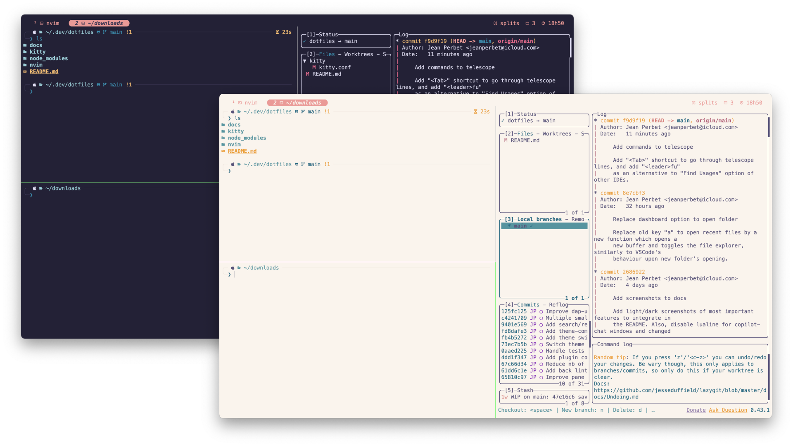
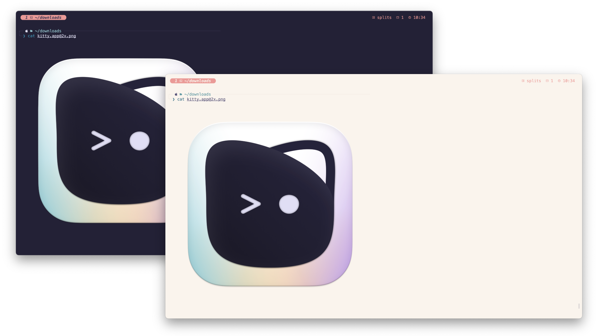
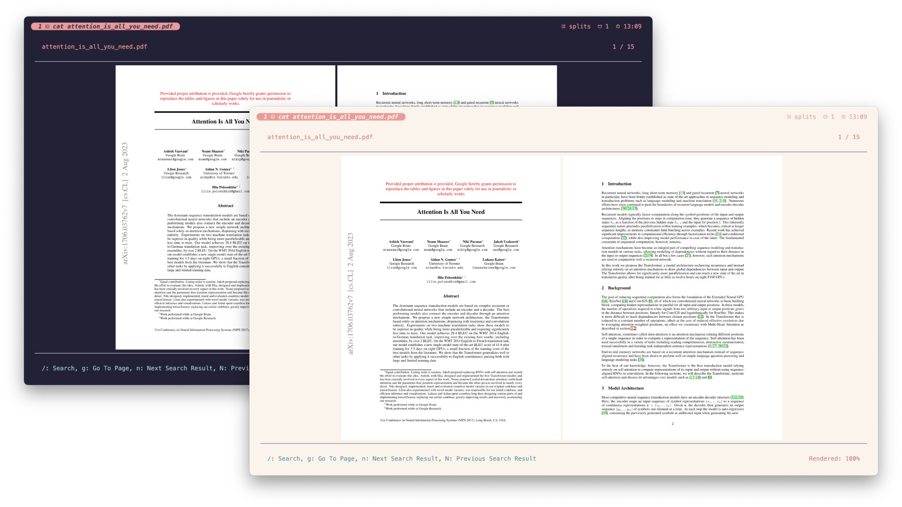
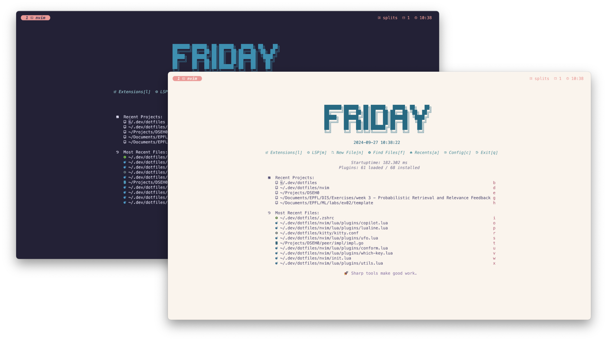

# My terminal configuration

This repository contains all the needed configuration files for an outstanding terminal featuring multi-tabs, pane-splitting, images display, improved common commands and an amazing IDE-like text editor.

It was curated for **macOS** and **Linux**, and it leverages awesome [`Rosé Pine`](https://rosepinetheme.com) theme, offering both light & dark modes, as well as [`MesloLGS`](https://github.com/ryanoasis/nerd-fonts/tree/master/patched-fonts/Meslo) font.



## Installation

The whole configuration relies on $3$ components.

- A shell => [`zsh`](https://fr.wikipedia.org/wiki/Z_Shell)
- A terminal emulator => [`kitty`](https://sw.kovidgoyal.net/kitty/)
- An embedded IDE => [`neovim`](https://neovim.io)

Let's dive into each of these components step-by-step. The configuration is adapted to both **macOS** & **Linux**, please follow the next instructions according to your OS. To get started, clone this repository in your `$HOME` directory.

```sh
git clone https://github.com/jeanprbt/dotfiles.git ~/.dotfiles
```

### Shell

You need to make sure that your shell is `zsh`, using `echo $SHELL`. It should be case on macOS since it is the default shell, here's how to change it otherwise.

```sh
apt update
apt install zsh
chsh -s $(which zsh)
```

Restart your shell, and now the previous command should output the path of your `zsh` executable. Then, let's install the core tools of the configuration.

| Package | Purpose | macOS (Homebrew) | Linux (apt/pacman/etc.) |
| --- | --- | --- | --- |
| [fzf](https://junegunn.github.io/fzf/) | Fuzzy search | `brew install fzf` | `apt install fzf` *ensure v >= 0.48.0* |
| [fd](https://github.com/sharkdp/fd) | Better `find` | `brew install fd` | `apt install fd-find` |
| [zoxide](https://github.com/ajeetdsouza/zoxide) | Better `cd` | `brew install zoxide` | `apt install zoxide` |
| [eza](https://github.com/eza-community/eza) | Better `ls` | `brew install eza` | Follow [instructions](https://github.com/eza-community/eza/blob/main/INSTALL.md) |
| [bat](https://github.com/sharkdp/bat) | Better `cat` | `brew install bat` | `apt install batcat` |
| [poppler](https://poppler.freedesktop.org/) & [imagemagick](https://imagemagick.org/) | PDF preview rendering | `brew install poppler imagemagick` | `apt install poppler-utils imagemagick `</div> |

Optionally, you can install the following tools to get a better display of `.md` and `.csv` files and be able to go through PDFs directly within your terminal.

| Package | Purpose | macOS (Homebrew) | Linux (apt/pacman/etc.) |
| --- | --- | --- | --- |
| [mdcat](https://github.com/swsnr/mdcat) | Prettier markdown display | `brew install mdcat`  | Follow [instructions](https://github.com/swsnr/mdcat)  |
| [csvlens](https://github.com/YS-L/csvlens) | Prettier csv display | `brew install csvlens` | Follow [instructions](https://github.com/YS-L/csvlens#Installation) |
| [tdf](https://github.com/itsjunetime/tdf) | PDF rendering | Follow [instructions](https://github.com/itsjunetime/tdf?tab=readme-ov-file) | same |

Next, let's install some useful `zsh` plugins in their dedicated directory to be easily sourced.

```sh
mkdir -p ~/.zsh_plugins && cd ~/.zsh_plugins
git clone https://github.com/romkatv/powerlevel10k.git
git clone https://github.com/zsh-users/zsh-autosuggestions
git clone https://github.com/zsh-users/zsh-syntax-highlighting
git clone https://github.com/Aloxaf/fzf-tab
```

Finally, include the configuration files of this repository in your `~/.zshrc` file. If you don't have one, create it.

```sh
# .zshrc
source ~/.dotfiles/zsh/.zshrc
```

Restart your shell again or run `exec zsh`, and you're good to go with the shell! You're seeing the default layout of [powerlevel10k](https://github.com/romkatv/powerlevel10k), go ahead to the next section for more customization.

### Terminal emulator

Let's install the font for this configuration, namely [Meslo](https://github.com/andreberg/Meslo-Font). Here's how to check if it is already downloaded.

```sh
fc-cache -fv
fc-list | grep -i meslo 
```

If nothing appears, follow these instructions.

- **macOS**

    ```sh
    brew install --cask font-meslo-lg-nerd-font
    ```

- **Linux**

    ```sh
    mkdir -p ~/.local/share/fonts && cd ~/.local/share/fonts
    wget https://github.com/ryanoasis/nerd-fonts/releases/latest/download/Meslo.zip
    unzip Meslo.zip && rm Meslo.zip
    ```

Next, let's install [kitty](https://sw.kovidgoyal.net/kitty/)!

| macOS (Homebrew) | Linux|
| --- | --- |
| `brew install --cask kitty`  | `curl -L https://sw.kovidgoyal.net/kitty/installer.sh \| sh /dev/stdin` |

We are ready to create a symlink to the `kitty` configuration files of this repository.

```sh
mv ~/.config/kitty ~/.config/kitty.bak # back up your current config
ln -s ~/.dotfiles/kitty ~/.config
```

Start kitty, and enjoy your new terminal! Now that both the font and emulator are correctly installed, feel free to run `p10k configure` so as to custom your shell layout.

> Troubleshooting - if you see a message such as `Last login: Wed Jun 11 10:32:11 on ttys003` each time you open `kitty`, simply run `touch ~/.hushlogin` to fix this issue.

### Embedded IDE

As you may have noticed, we will rely on [neovim](https://neovim.io/) for this one. Let's install it.

| macOS (Homebrew) | Linux (apt/pacman/etc.) |
| --- | --- |
| `brew install neovim`  | `apt install neovim` *ensure v >= 0.10.0* |

Let's also install additional tools it will rely on.

| Package | Purpose | macOS (Homebrew) | Linux (apt/pacman/etc.) |
| --- | --- | --- | --- |
| [node](https://nodejs.org/en) | Copilot runtime | `brew install node`  | Follow [instructions](https://nodejs.org/en/download) |
| [ripgrep](https://github.com/BurntSushi/ripgrep) | Recursive search | `brew install ripgrep` | `apt-get install ripgrep` |
| [awrit](https://github.com/chase/awrit) |  Terminal browser (markdown rendering) | `brew install awrit` | `curl -fsS https://chase.github.io/awrit/get \| DOWNLOAD_TO=~/<download_dir> bash` |
| [ghostscript](https://www.ghostscript.com) | PDF rendering | `brew install gs`  | `apt install ghostscript` |

Finally, as before, we are ready to create a symlink to `nvim` configuration files of this repository.

```sh
mv ~/.config/nvim ~/.config/nvim.bak # back up your current config
ln -s ~/.dotfiles/nvim ~/.config
```

Launch `nvim`, and plugins should download automatically. Once it's done, you're good to go with a fully-featured embedded IDE!

## Usage

You can now use your terminal with the following features.

### Shell

- **History** : navigate w/ `↑` `↓` arrows, or fuzzy search with `Ctrl` `R`.
- **Auto suggestions** : type a command, and accept auto-suggestion with `→`.
- **Tab completion** : use `Tab` to complete commands, files, directories, etc. using beautiful `fzf` interface.
- **Syntax highlighting** : commands are highlighted as you type, so that you easily spot errors.
- **Fuzzy search**: Press `Ctrl` `T` to search for any file or directory whose path begins with your current location, complete with a content preview. Use `,` + `Tab` to auto-complete the appropriate part of your command (e.g., hostnames for `ssh`, process IDs for `kill`, container names for `docker`, ...).
- **Better commands**: `ls` uses `eza` for prettier output, `cd` uses `zoxide` for navigation with partial paths.


| Image | PDF |
| --- | --- |
|  |  |


And of course, shell is beautified with `powerlevel10k`, which you can customize by running `p10k configure`.

### Terminal emulator

- **Multi-tabs**: open multiple tabs in `kitty`, each with its own shell instance. Use `⌘` `T` (`Ctrl` `⇧` `T`) to open a new tab, and `⌘` `W` (`Ctrl` `⇧` `T`) to close the current one.
- **Multi-panes**: split your terminal into multiple panes, each with its own shell instance. Use `Ctrl` `/` to split vertically, and `Ctrl` `-` to split horizontally. Switch to different [kitty layouts](https://sw.kovidgoyal.net/kitty/layouts/) using `Ctrl` `N`.
- **Search terminal canvas**: use `⌘` `F` (`Ctrl` `F`) to fuzzy-search for text in the current terminal pane, again using awesome `fzf` interface, and navigate through results with `Ctrl` `J` and `Ctrl` `K`.  
- **Theme switching**: use `toggle-theme` command to switch between light & dark modes, curated by `Rosé Pine`.
- **PDF & image rendering**: use `cat` to seamlessly display images, PDFs, csv files, markdown files, etc. nicely formatting them in your teminal, thanks to `bat`, ` mdcat`, `csvlens` and `tdf`.
- **Command broadcasting**: use `⌘` `B` (`Ctrl` `B`) to broadcast a command to all open panes, allowing you to run the same command in multiple contexts at once.

### Embedded IDE

My `neovim` configuration relies on [lazy.nvim](https://github.com/folke/lazy.nvim) for plugin management, and it has lots of features. 

It comes with a consistent theme with `kitty` and `zsh` in both dark & light mode, which adapts as `toggle-theme` is used. It features a nice welcome dashboard, a bufferline to work on multiple files, refined command line/notifications layout and a bottom line with useful information such as current language, progress within the file, enabled LSPs & formatters, Copilot status, current python virtual environement, and more.



#### Keybindings

I set the `<leader>` key to `,` to trigger commands, feel free to change it in `/nvim/init.lua`. Thanks to [`which-key`](https://github.com/folke/which-key.nvim), available keybindings are displayed as you type. Here's a summary.

| Keybinding | Action |
| --- | --- |
| `<leader>` `gb` | Toggle `git blame` functionality |
| `<leader>` `ct` | Close other tabs |
| `<leader>` `cc` | Toggle *Copilot Chat* |
| `<leader>` `cr` | Reset *Copilot Chat* history |
| `<leader>` `mr` | Toggle pretty in-buffer markdown rendering |
| `<leader>` `mp` | Toggle markdown preview using `awrit` on a side-tab|
| `<leader>` `Space` | Toggle file explorer |
| `<leader>` `;` | Get back to file explorer if opened |
| `<leader>` `ht` | Toggle horizontal terminal pane |
| `<leader>` `vt` | Toggle vertical terminal pane |
| `<leader>` `wt` | Toggle overlay terminal pane |
| `<leader>` `lg` | Toggle [`lazygit`](https://github.com/jesseduffield/lazygit) terminal |
| `<leader>` `td` | Toggle diagnostics (i.e. warnings, errors, etc.) |
| `<leader>` `rn` | Rename current variable |
| `<leader>` `ca` | See available LSP actions |
| `H` | Open hover documentation for current variable |
| `<leader`> `sv` | Select python virtual environment |
| `<leader>` `ff` | Fuzzy search for files |
| `<leader>` `fg` | Fuzzy search for any content in the working directory |


#### LSP & autocompletion

This configuration also comes with autocompletion, LSP support (i.e. warning, errors, etc.), syntax highlighting and auto-formatting. It only supports `lua` and `python` by default, but you can easily add support for other languages by installing the appropriate LSP servers and formatters in `/nvim/lua/plugins/lsp.lua` and `/nvim/lua/plugins/conform.lua`.

Use `<Ctrl> E` to dismiss autocompletion suggestions, `<Tab>` and `⇧ <Tab>` to navigate them and `<Enter>` to accept the current one.

#### Remote development

This configuration comes with remote development support, allowing you to connect to a remote server via SSH / docker container and work on files directly within `nvim`. Use `RemoteStart` to start a remote session, and `RemoteStop` to stop it. You can also use `RemoteInfo` to get information about active/inactive sessions. 

#### Copilot

This configuration comes with *Copilot* support, both via *Copilot Chat* (see [keybindings](#keybindings)) and inline suggestions, that you can accept with `<Tab>`. Use `:Copilot auth` to authenticate with your account.
