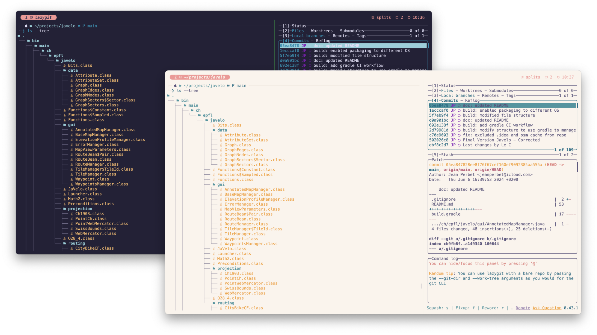
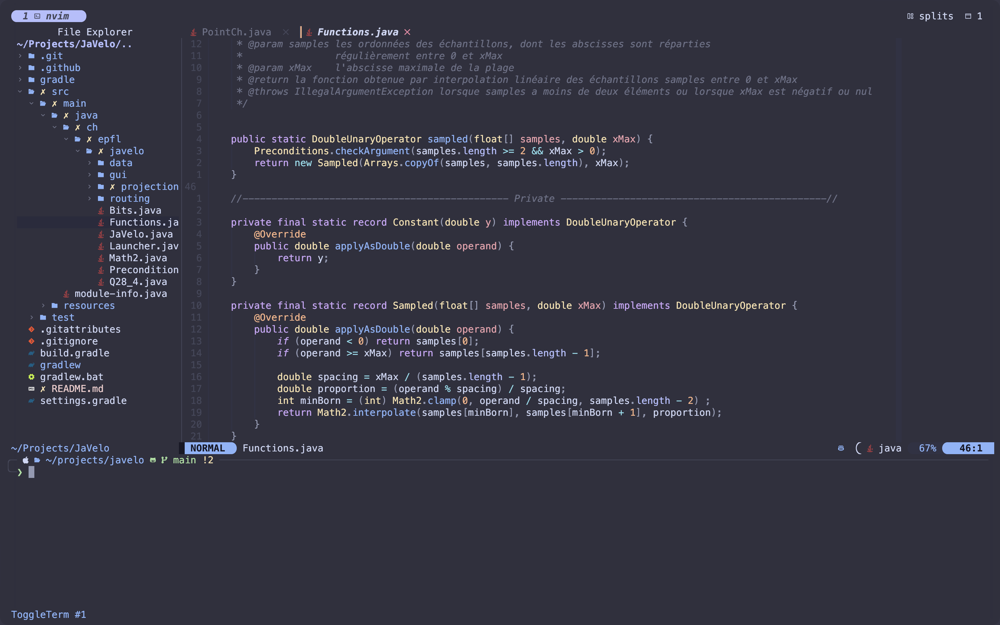
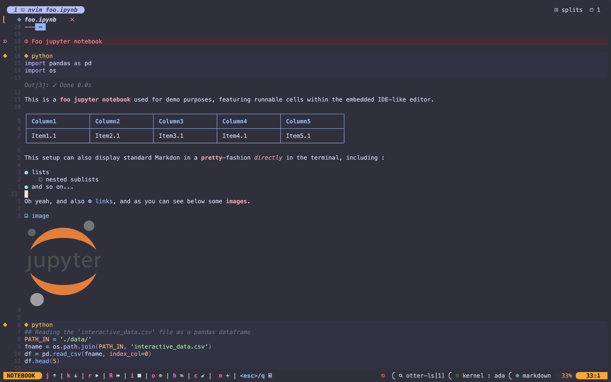

# My terminal configuration

This repository contains all the needed configuration files for an outstanding terminal featuring multi-tabs & pane-splitting, images display, refined common commands and an amazing IDE-like text editor. 

