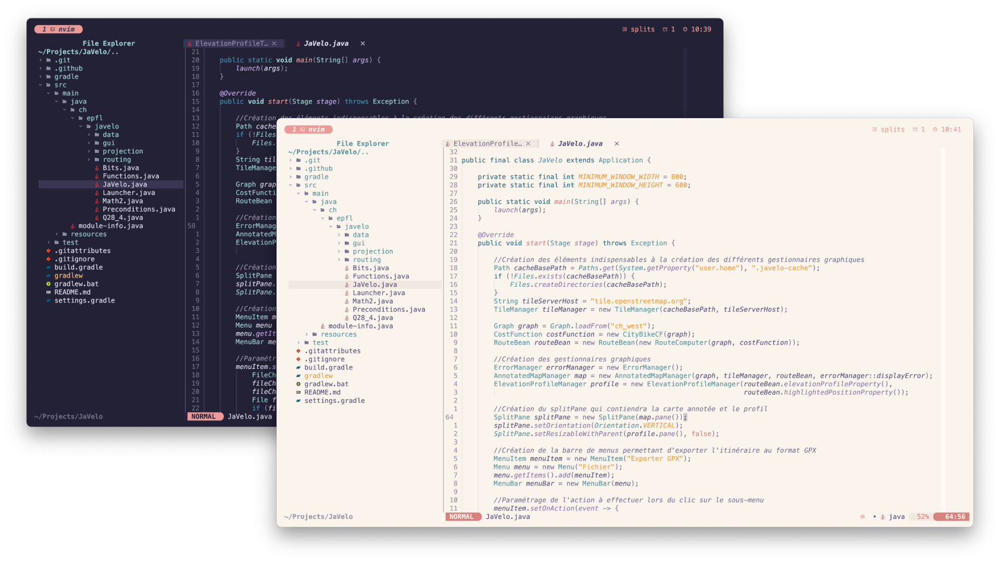
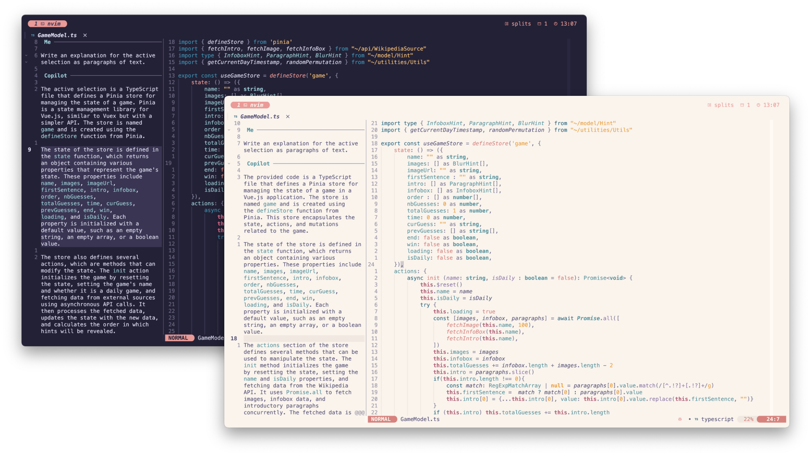
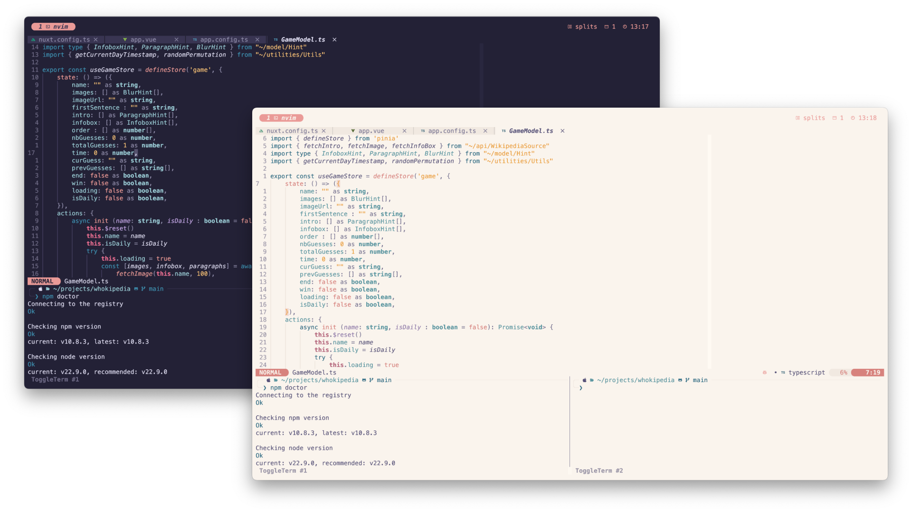
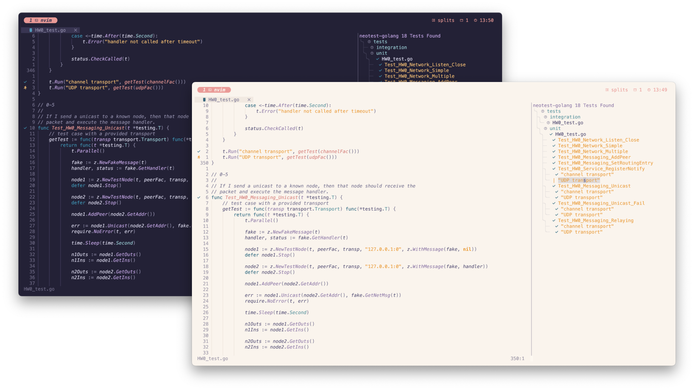
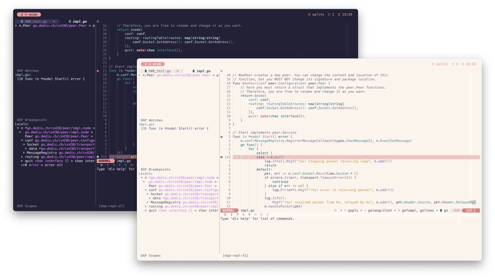

# My terminal configuration
This repository contains all the needed configuration files for an outstanding terminal featuring multi-tabs & pane-splitting, images display, refined common commands and an amazing IDE-like text editor. It was curated for macOS, but most of the functionality is also available for Linux. It uses awesome [Rosé Pine](https://rosepinetheme.com) theme, offering both light & dark modes.

Here's an overview of the most important features.

### Pane-splitting 

### Images & PDF support

### IDE-like text editor

 

#### File explorer

#### Copilot

#### Integrated terminal(s)

#### Tests

#### Debugging

## Overview
The whole configuration relies on three components.
- A shell => [`zsh`](https://fr.wikipedia.org/wiki/Z_Shell)
- A terminal emulator => [`kitty`](https://sw.kovidgoyal.net/kitty/)
- An embedded IDE => [`neovim`](https://neovim.io)

## Installation
In order to install the present configuration, you can clone this directory on your own system and create symbolic links to the files/folders of interest.
